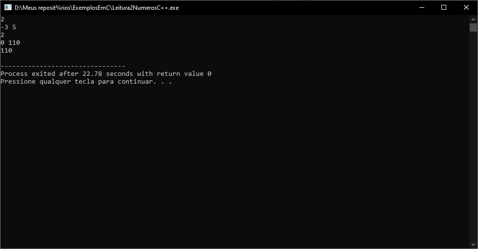

# Reading two numbers – C/C++/C\#

A common issue in competitive programming is reading two numbers before solve the main problem. In several programming languages this is an easy task, but we need to pay attention to some points.

In built-in C# libraries, we haven’t a method like _`scanf`_from C/C++. This could be tricky whether you don’t know about string manipulation.

First, let’s see how to read two numbers in C language. Let the following problem.

### 1. Problem

> Make a program that reads an integer _TC_ as number of test cases, and in the next line, two integers, A and B. Calculate and print the sum of A and B.

#### 1.1. Constraints

$$
1 \leq TC \leq 100 \\ -1000 \leq A \leq 1000 \\ -1000 \leq B \ 1000
$$

#### 1.2. Sample Input

> 2
>
> \-3 5
>
> &#x20;0 110

#### 1.3. Sample Output

> 2
>
> 110



### 2. Simple solution in C

```c
#include<stdio.h>

int main() {
	int TC, A, B;

	scanf("%d", &TC);

	while (TC--) {
		scanf("%d %d", &A, &B);
		printf("%d\n", A + B);
	}
	
	return 0;
}
```

Note that we use `scanf` to read the separated numbers. That was a piece of cake, thanks to `scanf`.

### 3. Simple solution in C++

Let’s see the solution in C++ using `iostream`(easy way).

```cpp
#include <iostream>

using namespace std;

int main(){
	int TC, A, B;
	
	cin >> TC;
	
	while(TC--)
	{
		cin >> A >> B;
		
		cout << A + B << endl;
	}

  	cout << flush;

 	return 0;
}
```

Of course, we can use _`scanf`_in both, C and C++, languages. What about C#?

### 4. C# approach I - using Split + Convert

```csharp
static void DoFirstSolution() // Using Split and Convert
{
    int TC, A, B;
    string input_nextLine;

    TC = Convert.ToInt32(Console.ReadLine());

    while (TC > 0)
    {
        input_nextLine = Console.ReadLine();
        A = Convert.ToInt32(input_nextLine.Split(' ')[0]);
        B = Convert.ToInt32(input_nextLine.Split(' ')[1]);

        Console.WriteLine(A + B);
        TC--;
    }
}
```

Commonly, in C# we use `ReadLine`method to read an input from the console. In this way, input is treated as a string data type. Therefore, we need to split data to get the numbers of the sum only (and not the blank space between them). Let’s take a look at another possible solution.

### 5. C# approach II - using Split + Parse

```csharp
static void DoSecondSolution() // Using Split + Parse
{
    int TC, A, B;
    string[] input_nextLine;

    TC = Convert.ToInt32(Console.ReadLine());

    while (TC > 0)
    {
        input_nextLine = Console.ReadLine().Split();
        A = int.Parse(input_nextLine[0]);
        B = int.Parse(input_nextLine[1]);

        Console.WriteLine(A + B);
        TC--;
    }
}
```

`Parse`can be faster, but it's less secure than `Convert`(previous approach). Note the way we split data in this example (fairly different than approach I).

### 6. C# approach III - using LINQ

```csharp
static void DoThirdSolution() // Using LINQ
{
    int TC, A, B;
    IEnumerable<int> input_nextLine = null;

    TC = Convert.ToInt32(Console.ReadLine());

    while (TC > 0)
    {
        input_nextLine = Console
            .ReadLine()
            .Split()
            .Select(int.Parse);
        A = input_nextLine.ToList()[0];
        B = input_nextLine.ToList()[1];

        Console.WriteLine(A + B);
        TC--;
    }
}
```

With _LINQ_ we can read the line, split the input data, and select the value to parse. Note the use of the `IEnumerable`interface. A very convenient way to solution.

### 7. C# approach IV - using LINQ and regular expressions (regex)

```csharp
static void DoFourthSolution() // Using LINQ + Regex
{
   int TC, A, B;
   
   TC = Convert.ToInt32(Console.ReadLine());
   
   while (TC > 0)
   {
       var numbers = from Match number in new Regex(@"\d+").Matches(Console.ReadLine())
                     select int.Parse(number.Value);
       A = numbers.ToList()[0];
       B = numbers.ToList()[1];

       Console.WriteLine(A + B);
       TC--;
   }
}
```

Despite of this approach hasn't use `IEnumerable`interface, we was able to use a "select-from" way (via _LINQ_) to search the numbers in the input, parse, and sum them.

### 8. C# approach V - using input arguments

```csharp
static void Main(string[] args) // Using input args
{
    int TC = Convert.ToInt32(args[0]);
    int argsCount = 1;

    while(TC > 0)
    {
        int A = Convert.ToInt32(args[argsCount]);
        int B = Convert.ToInt32(args[argsCount + 1]);

        Console.WriteLine(A + B);
        argsCount+=2;
        TC--;
        }
    }
```

In this example, we use the "Main method approach". Here, we've configured the initial string arguments before run the program. To configure _args_ in Visual Studio, follow those steps:

* Open `Project Settings (right click on your project name)` > `Debug`, and set `Command Line Arguments`. Example: 2 100 -3 85 91.
* Save, build and run your project.

### 9. Conclusion

There are several ways to read numbers using C#. But, in contrast of C and C++, in C#, the built-in libraries treat input numbers as string. Nevertheless, C# has powerful components, like _LINQ_, that make the life of programmer easier.

### 10. References

* [Competitive Programming 3, by Steven Halim, Felix Halim](https://www.amazon.com.br/Competitive-Programming-Halim-3-Ed/dp/B00FG8MNN8/)
* [PY4U.NET - reading two integers in one line using C#](https://www.py4u.net/discuss/711335)
